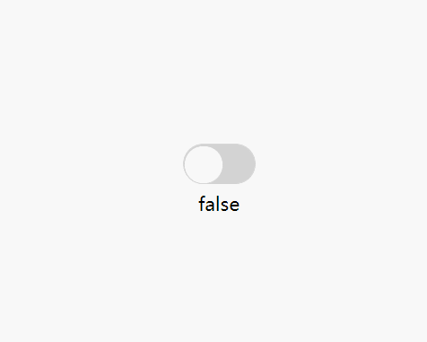

# react-native-animated-switch

Living version, 96 lines of code's switch implementation for Android and iOS.

## Demo

url: https://snack.expo.io/@zhangbao90s/animated-switch-v0.0.2



## Install

Just copy `AnimatedSwitch.js`'s code from demo above to your project.

## Usage

```js
import AnimatedSwitch from './AnimatedSwitch'

<AnimatedSwitch
  value={false}
  onValueChange={value => console.log(value)}
/>
```

## Props

| Prop          | Type     | Optional | Default value | Description                            |
| ------------- | -------- | -------- | ------------- | -------------------------------------- |
| value         | Boolean  | true     |               | Default state.                         |
| onValueChange | Function | true     |               | Trigger after switch state is changed. |
| onColor       | String   | true     | dodgerblue    | Active color.                          |
| offColor      | String   | true     | lightgray     | Inactive color.                        |

## License

MIT
